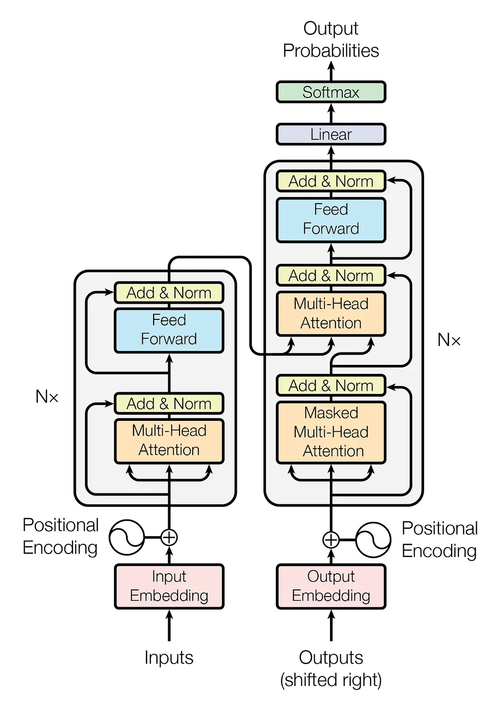

# Attention_From_Scratch

# **SimpleAttention: A Beginner’s Guide to Building an Attention Model**  
**A simplified implementation of the "Attention Is All You Need" paper.**  
This project walks you through creating a basic Attention-based model from scratch. If you're curious about how modern deep learning models like Transformers work, this is a great place to start!

---

## 🌟 What You’ll Learn  
- **Self-Attention:** The magic behind how models focus on the most important parts of input sequences.  
- **Multi-Head Attention:** How multiple attention "heads" improve the model’s performance.  
- **Positional Encoding:** Why and how we give the model a sense of order in sequences.  
- **Customizable Architecture:** Adjust the number of layers and attention heads to experiment with the model’s complexity.

---
## 🖼️ Transformer Architecture Diagram



Source: [Attention Is All You Need](https://arxiv.org/abs/1706.03762)

---
## 📚 What’s Inside  
- **Core Attention Module:** The building block of the Transformer.  
- **Simple and Clean Code:** Written with beginners in mind, using clear and well-commented code.  
- **Dataset Flexibility:** Works with text datasets like IMDB reviews or your own custom data.

---

## 🚀 How to Get Started  
1. Clone the repository and install dependencies.  
2. Train your own Attention-based model on any text dataset!  

```bash
git clone https://github.com/saeidtaleghani23/Attention_From_Scratch.git
cd Attention_From_Scratch
conda env create -f ./env/environment.yml
conda activate transformer_env
python train.py --dataset your_dataset

```

## 📖 References
- [Attention Is All You Need](https://arxiv.org/abs/1706.03762)  
- [PyTorch Documentation](https://pytorch.org/docs/stable/index.html)

